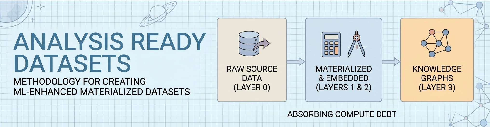
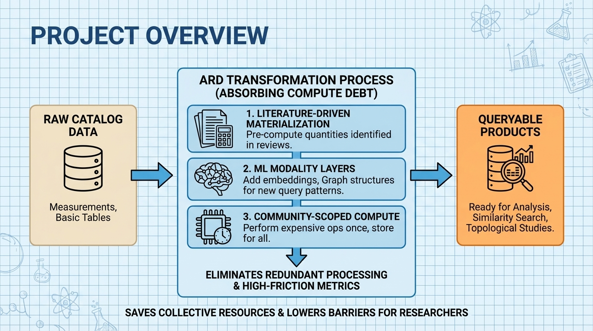
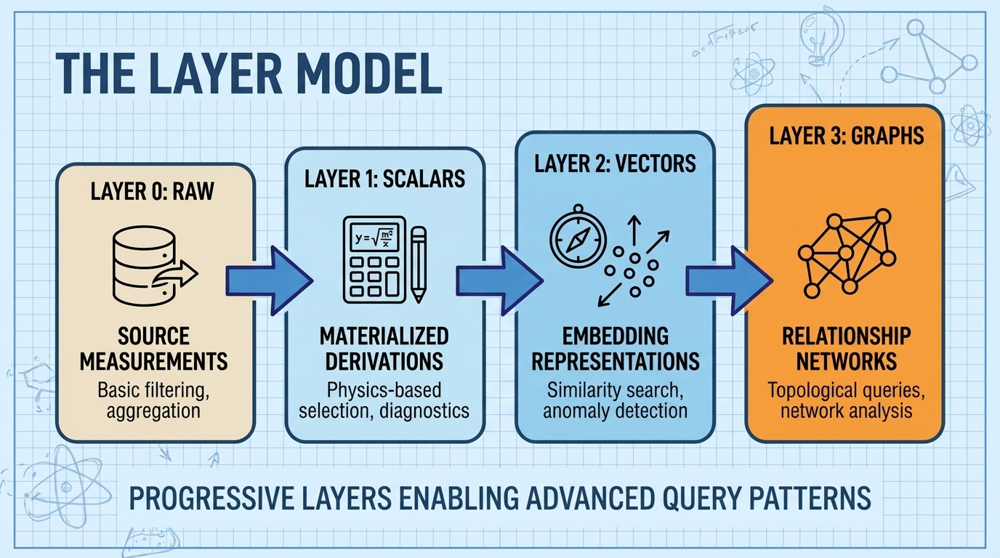

<!--
---
title: "Analysis Ready Datasets"
description: "Methodology and knowledge base for creating ML-enhanced materialized datasets"
author: "CrainBramp"
date: "2025-01-06"
version: "1.0"
status: "Active"
tags:
  - type: project-root
  - domain: framework
  - tech: [embeddings, postgresql, parquet]
related_documents:
  - "[DESI Implementation](https://github.com/radioastronomyio/desi-cosmic-void-galaxies)"
  - "[Steam Dataset 2025](https://github.com/radioastronomyio/steam-dataset-2025)"
---
-->

# 🎯 Analysis Ready Datasets

[]()
[]()
[](LICENSE)



> Methodology and knowledge base for creating Analysis Ready Datasets—enhanced, materialized datasets that absorb the compute debt of research communities.

Analysis Ready Datasets (ARDs) transform raw catalog data into queryable products where common derived quantities have been pre-computed. Rather than distributing raw measurements and expecting each researcher to independently derive what they need, an ARD front-loads the computational cost of "high-friction metrics"—the calculations that appear repeatedly in published research but require significant compute to generate.

---

## 🔭 Overview

This section provides context for the ARD concept and methodology. If you're already familiar with the layer model, skip to [Case Studies](#-case-studies).



The ARD concept addresses a fundamental inefficiency in data-intensive research: every research group repeats the same foundational processing steps—fitting continua, measuring indices, calculating local densities. This redundancy wastes collective compute resources and creates barriers for researchers without HPC access.

ARDs extend beyond traditional Value-Added Catalogs (VACs) through three distinguishing characteristics:

1. Literature-driven materialization: Derived quantities identified through systematic review of what researchers actually compute
2. ML modality layers: Enhancement with embeddings, graph structures enabling new query patterns (similarity search, topological analysis)
3. Community-scoped compute absorption: Expensive operations performed once with high rigor, converting processor time into storage space

---

## 🎯 Target Audience

| Audience | Use Case |
|----------|----------|
| ARD Implementers | Methodology guidance for building domain-specific ARDs |
| Data Scientists | Patterns for ML-enhanced dataset design |
| Researchers | Understanding what ARDs provide and how to use them |

---

## 📊 Project Status

| Area | Status | Description |
|------|--------|-------------|
| Framework Documentation | 🔄 In Progress | Core methodology being extracted from case studies |
| DESI Case Study | 🔄 In Progress | Full layer stack implementation |
| Steam Case Study | ⬜ Planned | Retrospective documentation of proto-ARD |
| Publication | ⬜ Planned | Methodology paper with case studies |

---

## 🏗️ The Layer Model

ARDs are built in progressive layers, each enabling query patterns impossible at the layer below.



| Layer | Contents | Query Patterns Enabled |
|-------|----------|------------------------|
| 0: Raw | Source measurements as released | Basic filtering, aggregation |
| 1: Scalars | Literature-validated derived quantities | Physics-based selection, diagnostics |
| 2: Vectors | Embedding representations | Similarity search, anomaly detection |
| 3: Graphs | Relationship structures | Topological queries, network analysis |

Each layer builds on the one below—embeddings over enriched feature spaces capture more meaning than embeddings over raw measurements alone.

---

## 📁 Repository Structure

```
analysis-ready-datasets/
├── 📂 docs/
│   ├── 📂 framework/           # ARD concept, layer model, methodology
│   ├── 📂 case-studies/        # Domain-specific implementations
│   │   ├── 📂 desi/            # DESI spectroscopic survey ARD
│   │   └── 📂 steam/           # Steam Dataset 2025 (proto-ARD)
│   └── 📂 documentation-standards/
├── 📂 research/                # GDR outputs, discovery artifacts
├── 📂 assets/                  # Figures, diagrams
├── 📂 work-logs/               # Development history
├── 📄 LICENSE
├── 📄 LICENSE-DATA
└── 📄 README.md                # This file
```

---

## 📚 Case Studies

| Case Study | Domain | Status | Description |
|------------|--------|--------|-------------|
| [DESI ARD](docs/case-studies/desi/) | Astronomy | 🔄 Active | ~6.4M extragalactic objects with full layer stack |
| [Steam Dataset 2025](docs/case-studies/steam/) | Gaming | ⬜ Retrospective | Proto-ARD demonstrating cross-domain applicability |

### DESI Spectroscopic Survey

The primary case study driving methodology development. The Dark Energy Spectroscopic Instrument provides ~18M spectra; this ARD implements scalar materializations (stellar mass, SFR, environmental metrics), spectral embeddings (Universal Spectrum Tokenizer, AstroCLIP), and cosmic web topology.

Implementation: [desi-cosmic-void-galaxies](https://github.com/radioastronomyio/desi-cosmic-void-galaxies)

### Steam Dataset 2025

A gaming catalog enhanced with BGE-M3 embeddings and graph-ready relationships. Developed before the ARD concept was formalized, serving as retrospective validation that the pattern has practical value across domains.

Implementation: [steam-dataset-2025](https://github.com/radioastronomyio/steam-dataset-2025)

---

## 🌟 Open Science Philosophy

We practice open science and open methodology—our version of "showing your work":

- Research methodologies are fully documented and repeatable
- Discovery processes (GDR sessions, literature reviews) are preserved as artifacts
- Implementation patterns are published so others can adapt them
- Learning processes are captured for community benefit

---

## 🚀 Getting Started

### For ARD Implementers

1. Review the [Framework Documentation](docs/framework/) for methodology
2. Study the [DESI Case Study](docs/case-studies/desi/) for a complete example
3. Adapt the discovery approaches (literature-driven, schema-driven) to your domain

### For Researchers Using ARDs

1. Find the ARD for your domain in [Case Studies](docs/case-studies/)
2. Access the implementation repository for data products
3. Query pre-computed columns instead of deriving them yourself

---

## 📄 License

Documentation: MIT License — see [LICENSE](LICENSE) for details.  
Data products: See [LICENSE-DATA](LICENSE-DATA) for dataset-specific terms.

---

## 🙏 Acknowledgments

- DESI Collaboration — Source data for primary case study
- Open source ML community — Foundation models enabling the vector layer

---

Last Updated: 2025-01-06 | Active Development
